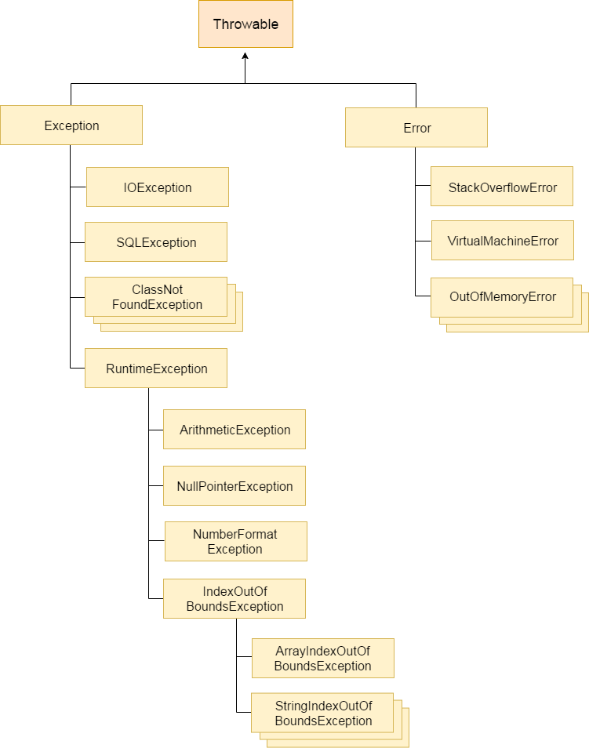

# Giới thiệu chung về Java

<a id = "p0"></a>

## Mục Lục

- [Quay lại phẩn tổng quan](README.md)
- [Java là gì](#p1)
- [Lịch sử của Java](#p2)
- [Các tính năng của Java](#p3)

  <a id = "p1"></a>

## Java là gì

- Java là ngôn ngữ lập trình hướng đối tượng, bậc cao, bảo mật và mạnh mẽ.
- Java có một môi trường runtime riêng cho mình (JRE) và API (Application Programming Interface), vì vậy được coi là một **Platform**

  - Một **Platform** được định nghĩa là một môi trường phần cứng hoặc phần mềm nào mà trong đó có một chương trình chạy

- Phương châm của java là **"Write Once, Run Everywhere"** - viết một lần và chạy được nhiều nơi

[Quay lại mục lục](#p0)

<a id = "p2"></a>

## Lịch sử của Java

- Java được phát triển lần đầu vào tháng 6, 1991 bởi James Gosling.
- Ban đầu, Java có tên là _"Oak"_, được đặt tên theo cây sồi phía ngoài văn phòng của Gosling.
- Sau đó, tên ngôn ngữ lần lượt đổi thành _"Green"_ và cuối cùng thành _"Java"_
- Phiên bản đầu tiên được hoàn thiện và công bố với tên Java 1.0 vào năm 1993.
- Vào năm 2006, Java trở thành phần mềm mở miễn phí
- Vào năm 2017, Java chuyển cách thức công bố từ 2 năm một lần thành 6 tháng một lần. Phiên bản mới nhất của Java (tới hiện tại) là Java 17 vào ngày 14/9/2021.
  - Từ phiên bản Java 9, phiên bản số lẻ sẽ được công bố vào tháng 9, trong khi bản số chẵn sẽ được công bố vào tháng 3.
- Có 4 platform của Java: Java Standard Edition _(Java SE)_, Java Enterprise Edition _(Java EE)_, Java Micro Edition _(Java ME)_, và JavaFX
- Các phiên bản long-term support hiện tại của Java bao gồm: Java SE 8, Java SE 11 và Java SE 17

[Quay lại mục lục](#p0)

<a id = "p3"></a>

## Các tính năng của Java

- **Hướng đối tượng**: Trong Java, mọi thứ đều là một Object. Java có thể dễ dàng mở rộng và bảo trì vì nó được xây dựng dựa trên mô hình Object.
- **Nền tảng độc lập**: Không giống nhiều ngôn ngữ lập trình khác bao gồm cả C và C ++, khi Java được biên dịch, nó không được biên dịch thành ngôn ngữ cho một nền tảng cụ thể, mà thành mã byte độc lập nền tảng. Mã byte này sau đó mới được thông dịch bởi máy ảo (JVM) trên nền tảng mà nó đang chạy.
- **Đơn giản** Java được thiết kế để dễ học. Nếu bạn hiểu khái niệm cơ bản về OOP Java, sẽ rất dễ để trở thành master về java.
- **Bảo mật** - Với tính năng an toàn của Java, nó cho phép phát triển các hệ thống không có virut hoặc can thiệp bên ngoài. Các kỹ thuật xác thực dựa trên mã hoá khóa công khai.
- **Kiến trúc trung lập** - Trình biên dịch Java tạo ra định dạng tệp đối tượng kiến trúc trung lập, làm cho mã biên dịch được thực thi trên nhiều bộ vi xử lý, với sự hiện diện của hệ điều hành Java.
- **Khả chuyển** - Sở hữu kiến trức trung lập và không có yếu tố thực thi phụ thuộc vào nền tảng khiến Java trở nên khả chuyển. Trình biên dịch trong Java được viết bởi ANSI C với giới hạn khả chuyển rõ ràng (ANSI C là tập con của POSIX)
- **Mạnh mẽ** - Java thực hiện việc loại trừ các tình huống dễ bị lỗi bằng cách tập trung kiểm tra lỗi tại compile time và runtime.
- **Đa luồng** - Với tính năng đa luồng của Java có thể viết các chương trình có thể thực hiện nhiều tác vụ đồng thời. Tính năng thiết kế này cho phép các nhà phát triển xây dựng các ứng dụng tương tác có thể chạy trơn tru hơn.
- **Thông dịch** - Mã byte Java được dịch trực tiếp tới các máy tính gốc và không được lưu trữ ở bất cứ đâu.
- **Hiệu năng cao** - Với việc sử dụng trình biên dịch Just-In-Time, Java cho phép thực hiện hiệu năng cao.
- **Phân tán** - Java được thiết kế cho môi trường phân tán của Internet.
- **Năng động** - Java được coi là có tính năng động hơn C hay C++ vì nó được thiết kế để thích nghi với môi trường biến đổi liên tục. Các chương trình Java có thể mang một lượng lớn thông tin runtime, từ đó có thể được sử dụng để xác minh và giải quyết truy cập vào các đối tượng tại runtime.

[Quay lại mục lục](#p0)

# Môi trường Java

<a id = "p0"></a>

## Mục Lục

- [Quay lại phẩn tổng quan](README.md)
- [Java Virtual Machine](#p1)
- [Java Runtime Environment](#p2)
- [Java Development Kit](#p3)

<a id = "p1"></a>

## Java Virtual Machine

- JVM (**J**ava **V**irtual **M**achine) là một thiết bị ảo giúp máy tính chạy các chương trình Java. Nó làm nhiệm vụ biên dịch code Java thành ngôn ngữ máy, và thiết bị thật sẽ tương tác với ngôn ngữ tạo thành từ máy ảo này.

- Mặc dù Java là độc lập nền tảng, nhưng JVM là phụ thuộc vào nền tảng nó chạy, do cấu hình của mỗi Operating System là khác nhau

- Các nhiệm vụ chính của JVM: tải code, kiểm tra code, thực thi code, cung cấp môi trường runtime

- Cấu trúc của JVM

  

      - Classloader: hệ thống của JVM dùng để tải class file
      - Class Area: lưu trữ cấu truc của các file class ( `attribute` và `method`)
      - Heap: khu vực lưu dữ liệu runtime mà các `object` được cấp
      - Stack: khu vực lưu trữ các frame. Frame là vùng nhớ được tạo khi một `method` được gọi tới, giữ các biến cục bộ và các kết quả cục bộ. Frame sẽ bị mất đi khi một phương thức kết thúc. Đối với xử lý đa luồng (multi-thread), mỗi thread sẽ có một stack riêng, được tạo thành ở cùng thời điểm thread được gọi ra.
          - Như vậy: stack chứa nhiều frame, một JVM có thể có nhiều stack (bằng với số lượng thread nó xử lý)
      - Program Counter Register: chứa địa chỉ của lệnh JVM hiện tại đang được thực thi
      - Native Method Stack: tất cả các `method` tự có của Java
      - Execution Engine: bao gồm một bộ xử lý ảo Virtual Processor và một trình thông dịch Interprêtrr để đọc bytecode stream sau đó thực thi các chỉ thị

  <a id = "p2"></a>

## Java Runtime Environment

- JRE (**J**ava **R**untime **E**nvironment) cung cấp môi trường runtime mà trong đó JVM sẽ thực hiện việc biên dịch ngôn ngữ lập trình thành ngôn ngữ máy.

- JRE bao gồm JVM, cùng với các thư viện class Java và các file khác mà JVM sẽ sử dụng trong quá trình runtime

<a id = "p3"></a>

## Java Development Kit

- JDK (**J**ava **D**evelopment **K**it) bộ công cụ phát triển java, bao gồm JRE và các development tool khác


# Các kiểu biến và dữ liệu trong Java

<a id = "p0"></a>

## Mục Lục

- [Quay lại phẩn tổng quan](README.md)
- [Giới thiệu chung](#p1)
- [Biến trong Java](#p2)
- [Kiểu dữ liệu trong Java](#p3)
- [Type casting với kiểu dữ liệu nguyên thủy](#p4)

<a id = "p1"></a>

## Giới thiệu chung

- Trong Java, biến là tên của vùng nhớ. Có tổng cộng là 3 kiểu biến trong Java: biển local, biến instance, và biến static

- Mỗi biến sẽ có một kiểu dữ liệu khác nhau. Kiểu dữ liệu trong Java lại được chia ra làm hai loại: kiểu nguyên thủy và kiểu đối tượng.

[Quay lại mục lục](#p0)

<a id = "p2"></a>

## Biến trong Java

- Cách khai báo biến trong java: biến trong java chỉ bắt đầu bằng một ký tự, 1 dấu gạch duối hoặc một kí tự dollar ($), bắt đầu từ ký tự thứ hai, có thể bằng ký tự, dấu gạch dưới, dollar hoặc một số

  ## Biến local

  - Biến local: được khai báo trong method, hoặc một code block
  - Biến local được tạo khi một method hoặc một code block được thực thi và sẽ bị hủy khi kết thúc method hoặc code lbock
  - Không dùng được `access modifier` cho biến local
  - Biến local chỉ sử dụng được trong nội bộ method hoặc code block nó được khai báo
  - Biến local được lưu trữ ở vùng nhớ stacked
  - Biến local không có default value, vì vậy bắt buộc phải khai báo giá trị ban đầu của biến local

  ## Biến instance

  - Biến instance được khai báo trong một class nhưng không nằm trong một method hay code block bất kỳ.
  - Khi tạo ra bộ nhớ heap của object thuộc class, bộ nhớ heap cùng tạo ra chỗ chứa cho các biến instance của object này bằng cách khai báo với từ khóa `new()`, và sẽ bị loại bỏ khi object bị loại bỏ
  - Biến instance có thể được sử dụng bởi các method và code block nhưng phải thông qua đối tượng cụ thể
  - Có thể sử dụng `access modifier` cho biến instance, với mặc định là `default`. Thông thường sẽ có giá trị là `private`
  - Khác với biến local, biến instance có giá trị default phụ thuộc vào kiểu dữ liệu của nó.
  - Biến instance có thể được sử dụng ở tất cả các method hoặc code block trong class nó được khai báo. Tuy nhiên với các method static, biến instance nên được gọi tên đầy đủ theo syntax _"ObjectReference.VariableName"_

  ## Biến static

  - Biến static được khai báo với từ khóa `static`. Giống như biến instance, nó được khai báo ngoài các method và code block của class
  - Với mỗi một class chỉ có duy nhất một vùng nhớ cho biến static, bất kể có bao nhiêu object được tạo ra từ class này (các object sẽ dùng chung vùng nhớ biến static).
  - Nếu như biến `local` được lưu trong bộ nhớ `stack`, biến `instance` nằm trong bộ nhớ `heap`, thì biến `static` nằm trong bộ nhớ `static` riêng của nó.
  - Biến `static` được tạo khi chương trình khởi tạo và bị xóa khi chương trình kết thúc
  - Biến `static` thường được sử dụng đề lưu trữ giá trị không đổi (từ khóa `final`). Thông thường các biến static có access modifier là `public` để có thể truy cập được dễ dàng. Giống như biến `instance`, biến `static` cùng có giá trị mặc định của nó tùy thuộc vào kiểu dữ liệu. Giá trị của biến `static` (không khai báo `final`) có thể được thay đổi trong một code block `static`
  - Biến `static` có thể được gọi với syntax: _"ClassName.VariableName"_

[Quay lại mục lục](#p0)

<a id = "p3"></a>

## Kiểu dữ liệu trong Java

- Có 2 loại kiểu dữ liệu trong Java: kiểu dữ liệu nguyên thủy và kiểu dữ liệu đối tượng

  ## Kiểu dữ liệu nguyên thủy

  - Có tổng cộng 8 kiểu dữ liệu nguyên thủy trong Java. Các kiểu dữ liệu này không cần định nghĩa khi sử dụng
    - `byte`: lưu trữ số nguyên có kích thước 1 byte - 8 bit. Phạm vi biểu diễn từ `-2^7` đến `2^7 - 1`. Giá trị mặc định là `0`
    - `short`: lưu trữ số nguyên có kích thước 2 byte. Phạm vi từ `-2^15` đến `2^15 - 1`. Giá trị mặc định là `0`
    - `int`: lưu trữ số nguyên có kích thước 4 byte. Phạm vi từ `-2^31` đến `2^31 - 1`. Giá trị mặc định là `0`
    - `long`: lưu trữ số nguyên có kích thước 8 byte. Phạm vi từ `-2^63` đến `2^63 - 1`. Giá trị mặc định là `0`
    - `float`: lưu trữ số thực có kích thước là 4 byte. Giá trị mặc định là `0.0F`.
    - `double`: lưu trữ số thực có kích thước là 8 byte. Giá trị mặc định là `0L`
    - `char`: lưu trữ kiểu kí tự hoặc giá trị Unicode. Do unicode dùng 2 byte dung lượng, nên kiểu `char` cũng có kích thước 2 byte. Phạm vi biểu diễn từ 0 đến u\ffff. Giá trị mặc định là `0`
    - `boolean` : dùng để lưu trữ dữ liệu đúng sai. Chỉ có 2 giá trị là `true` hoặc `false`. Giá trị mặc định là `false`

  ## Kiểu dữ liệu tham chiếu

  - Ngoài 8 kiểu dữ liệu nguyên thủy trên, Java còn kiểu dữ liệu tham chiếu
  - Kiểu dữ liệu tham chiếu được hình thành bằng cách sử dụng `constructor method` đã được định nghĩa của một class. Kiểu dữ liệu tham chiếu dùng để truy cập vào các đối tượng.
  - Giá trị mặc định của kiểu dữ liệu tham chiếu là `null`

[Quay lại mục lục](#p0)

<a id = "p4"></a>

## Type casting với kiểu dữ liệu nguyên thủy

- Type casting là hành động chuyển đổi giữa các kiểu dữ liệu nguyên thủy với nhau. Có 2 loại ép kiểu dữ liệu

- `Widening` (nới rộng): là quá trình chuyển đổi dữ liệu từ kiểu có kích thước nhỏ hơn sang kiểu dữ liệu có kích thước lớn hơn. Kiểu biến đổi này là ngầm định bởi trình biên dịch và không làm mất thông tin

  - Ví dụ

    ```java
    int i = 100;
    long l = i;
    double d = l;
    ```

  - Thứ tự nới rộng từ trái qua phải:
    ```
    byte -> short -> int -> long -> float -> double
    ```

- `Narrowing` (thu hẹp): là quá trình chuyển đổi dữ liệu từ kiểu có kích thước lớn hơn về kiểu dữ liệu có kích thước nhỏ hơn. Người lập trình phải khai báo thủ công việc chuyển đổi dữ liệu. Việc chuyển đổi ngầm định này có khả năng làm mất thông tin

  - Ví dụ

    ```java
    double d = 10.04 // d = 10.04;
    int i = (int) d // i = 10;
    ```

    Ở đây có thể thấy phần số sau dấu phẩy của biến `double d` đã mất đi khi chuyển kiểu dữ liệu về `int`

  - Thứ tự thu hpẹ từ trái qua phải:
    ```
    double -> float -> long -> int -> short -> byte
    ```

[Quay lại mục lục](#p0)

# Toán tử trong Java

<a id = "p0"></a>

## Mục Lục

- [Quay lại phẩn tổng quan](README.md)
- [Giới thiệu chung](#p1)
- [Toán tử số học](#p2)
- [Toán tử bit](#p3)
- [Toán tử logic](#p4)
- [Toán tử quan hệ](#p5)
- [Toán tử ba ngôi](#p6)

<a id = "p1"></a>

## Giới thiệu chung

- Toán tử trong java là các kí hiệu được sử dụng để thực hiện một phép tính / chức năng nào đó. Java có các dạng toán tử : số học, bit, quan hệ, logic, điều kiện, gán

[Quay lại mục lục](#p0)

<a id = "p2"></a>

## Toán tử số học

- Khai báo các giá trị của a và b như sau

```java
int a = 10
int b = 20
```

| Toán tử | Mô tả                                                                                                     | Ví dụ    | Kết quả   |
| :-----: | --------------------------------------------------------------------------------------------------------- | -------- | --------- |
|   `+`   | Trả về giá trị là tổng hai toán hạng                                                                      | `a + b`  | 30        |
|   `-`   | Trả về giá trị là hiệu hai toán hạng                                                                      | `a - b`  | -10       |
|   `*`   | Trả về giá trị là tích hai toán hạng                                                                      | `a * b`  | 200       |
|   `\`   | Trả về giá trị là thương của phép chia                                                                    | `b \ a ` | 2         |
|   `%`   | Trả về giá trị là phần dư phép chia                                                                       | `b % a`  | 0         |
|  `++`   | Tăng giá trị của biến thêm một                                                                            | `a++`    | 11        |
|  `--`   | Giảm giá trị của biến đi một                                                                              | `a--`    | 9         |
|  `+=`   | Cộng giá trị của toán hạng bên phải vào toán hạng bên trái và gán giá trị vào toán hạng bên trái          | `a += b` | `a = 30`  |
|  `+=`   | Trừ giá trị của toán hạng bên phải vào toán hạng bên trái và gán giá trị vào toán hạng bên trái           | `b -= a` | `b = 10`  |
|  `*=`   | Nhân giá trị của toán hạng bên phải với toán hạng bên trái và gán giá trị vào toán hạng bên trái          | `a *= b` | `a = 200` |
|  `/=`   | Chia giá trị của toán hạng bên trái cho toán hạng bên phải và gán thương phép chia vào toán hạng bên trái | `b /= a` | `b = 2`   |
|  `%=`   | Chia giá trị của toán hạng bên trái cho toán hạng bên phải và gán số dư phép chia vào toán hạng bên trái  | `b %= a` | `b = 0`   |

[Quay lại mục lục](#p0)

<a id = "p3"></a>

## Toán tử bit

- Toán tử bit cho phép thao tác trên từng bit đối với các kiểu dữ liệu nguyên thủy

|       Toán tử       | Mô tả                                                                                                                    |
| :-----------------: | ------------------------------------------------------------------------------------------------------------------------ |
|         `~`         | `NOT` - Trả về giá trị phủ định của một bit                                                                              |
|         `&`         | `AND` - Trả về giá trị 1 nếu các toán hạng cùng là 1 hoặc cùng là 0. 0 trong trường hợp khác                             |
| <code>&#124;</code> | `OR` - Trả về giá trị 1 nếu một hoặc nhiều hơn các toán hạng là 1. 0 trong trường trường hợp không có toán hạng nào là 1 |
|         `^`         | `Exclusive OR` - Trả về giá trị nếu chỉ duy nhất có một toán hạng là 1. 0 trong trường hợp khác                          |
|        `>>`         | Dịch phải: Chuyển toàn bộ các bit của 'toán hạng bên trái' sang phải một số lần được ghi ở 'phía bên phải toán hạng'.    |
|        `<<`         | Dịch trái: Chuyển toàn bộ các bit của 'toán hạng bên trái' sang trái một số lần được ghi ở 'phía bên phải toán hạng'.    |

[Quay lại mục lục](#p0)

<a id = "p4"></a>

## Toán tử logic

- Toán tử logic làm việc với các toán hạng Boolean

|          Toán tử          | Mô tả                                                                                                                  |
| :-----------------------: | ---------------------------------------------------------------------------------------------------------------------- |
|           `&&`            | `AND` - Trả về `TRUE` nếu cả hai toán tử là `TRUE`, `FALSE` trong các trường hợp còn lại                               |
| <code>&#124;&#124;</code> | `OR` - Trả về `TRUE` nếu có ít nhất một giá trị là `TRUE`, `FALSE` trong các trường hợp không có toán tử nào là `TRUE` |
|            `^`            | `XOR` - trả về `TRUE` nếu chỉ có một trong các giá trị là `TRUE`, `FALSE` trong các trường hợp còn lại                 |
|            `!`            | `NOT` - trả về giá trị ngược lại của giá trị toán tử bên trái                                                          |

[Quay lại mục lục](#p0)

<a id = "p5"></a>

## Toán tử quan hệ

- Các toán tử quan hệ được sử dụng kiểm tra mối quan hệ giữa hai toán hạng. Kết quả của một biểu thức có dùng các toán tử quan hệ là những giá trị Boolean ( `TRUE` hoặc `FALSE` ).

|       Toán tử        | Mô tả                                                                                                  |
| :------------------: | ------------------------------------------------------------------------------------------------------ |
|         `==`         | So sánh bằng: kiểm tra sự tương đương của hai toán hạng                                                |
| <code>&#124;=</code> | So sánh khác: kiểm tra sự khác nhau giữa hai toán hạng                                                 |
|         `>`          | So sánh lớn hơn: kiểm tra xem giá trị toán hạng bên trái có lớn hơn toán hạng bên phải không           |
|         `>=`         | So sánh lớn hơn: kiểm tra xem giá trị toán hạng bên trái có lớn hơn hoặc bằng toán hạng bên phải không |
|         `<`          | So sánh lớn hơn: kiểm tra xem giá trị toán hạng bên trái có nhỏ hơn toán hạng bên phải không           |
|         `<=`         | So sánh lớn hơn: kiểm tra xem giá trị toán hạng bên trái có nhỏ hơn hoặc bằng toán hạng bên phải không |

[Quay lại mục lục](#p0)

<a id = "p6"></a>

## Toán tử ba ngôi

- Syntax của toán tử ba ngôi

  ```java
  <biểu thức> ? <giá trị true> : <giá trị false>
  ```

      Trong đó
      - `Biểu thức` : biểu thức logic có giá trị là `TRUE` hoặc `FALSE`
      - `Giá trị true`: giá trị trả về nều biểu thức logic có giá trị `TRUE`
      - `Giá trị false`: giá trị trả về nều biểu thức logic có giá trị `FALSE`

[Quay lại mục lục](#p0)

# Câu lệnh điều khiển trong Java

<a id = "p0"></a>

## Mục Lục

- [Quay lại phẩn tổng quan](README.md)
- [Mệnh đề `if`-`else`](#p1)
- [Mệnh đề `switch` `case`](#p2)
- [Biểu thức `switch`-`yield`](#p3)
- [Vòng lặp `for`](#p4)
- [Vòng lặp `while` và `do`-`while`](#p5)
- [Từ khóa `break`, `yield` và `continue`](#p6)

<a id = "p1"></a>

## Mệnh đề `if`-`else`

- Mệnh đề `if`: kiểm tra giá trị boolean của biểu thức logic. Khối lệnh trong `if` được thực thi nếu biểu thức logic có giá trị `TRUE`

  ```java
  if (expression) {
  // khối lệnh này thực thi
  // nếu condition = true
  }
  ```

- Mệnh đề `if`-`else`: kiểm tra giá trị boolean của biểu thức logic. Khối lệnh trong `if` được thực thi nếu biểu thức logic có giá trị `TRUE`, khối lệnh trong `else` được thực hiện nếu biểu thức logic có giá trị `FALSE`

  ```java
  if (expression) {
      // khối lệnh này được thực thi
      // nếu condition = true
  } else {
      // khối lệnh này được thực thi
      // nếu condition = false
  }
  ```

- Mệnh đề `if`-`else` có thể lồng vào nhau

  ```java
  if (expression_1) {

  } else if (expression_2){

  } else
  {}
  ```

[Quay lại mục lục](#p0)

<a id = "p2"></a>

## Mệnh đề `switch` `case`

- Mệnh đề switch case được sử dụng để thực thi hoặc 1 hoặc nhiều khối lệnh từ một biểu thức với nhiều điều kiện

  ```java
  switch (bieu_thuc) {
  case gia_tri_1:
    // Khối lệnh 1
    break;  //tùy chọn
  case gia_tri_2:
    // Khối lệnh 2
    break;  //tùy chọn
  case gia_tri_n:
    // Khối lệnh n
    break;  //tùy chọn
  default:
    // Khối lệnh này được thực thi nếu tất cả các điều kiện trên không thỏa mãn
  }
  ```

  Chú ý: nếu không dùng từ khóa `break`, các khối lệnh sau `case` có giá trị phù hợp sẽ được thực hiện lần lượt cho đến khi gặp từ khóa `break` tiếp theo hoặc kết thúc mệnh đề switch-case

  [Quay lại mục lục](#p0)

<a id = "p3"></a>

## Biểu thức `switch`-`yield`

- Biểu thức switch-yield dùng để trả giá trị dựa trên nhiều điều kiện khác nhau

  ```java
  switch (bieu_thuc) {
  case dieu_kien_1 -> gia_tri_1
  case dieu_kien_1 -> gia_tri_2
  //.....
  case dieu_kien_n -> gia_tri_n
  default:
    // Khối lệnh này được thực thi nếu tất cả các điều kiện trên không thỏa mãn
  }
  ```

[Quay lại mục lục](#p0)

<a id = "p4"></a>

## Vòng lặp `for`

- Vòng lặp `for` được sử dụng để lặp một phần của chương trình nhiều lần, với số lần lặp được xác định trước

  ```java
  for (khoi_tao_bien ; check_dieu_kien ; tang/giam_bien) {
    // Khối lệnh được thực thi
  }
  ```

- Vòng lặp for-each được sử dụng để lặp trên mảng hoặc collection trong java

  ```java
  for (Type var : array) {
    // Khối lệnh được thực thi
  }
  ```

- Vòng lặp for có dãn nhãn: dùng để gán nhãn vòng lặp bằng cách ghi tên trước vòng lặp for. Rất hữu dụng khi sử dụng kèm các từ khóa `break` và `continue`

  ```java
  ten_nhan: for (khoi_tao_bien ; check_dieu_kien ; tang/giam_bien) {
    // Khối lệnh được thực thi
  }
  ```

[Quay lại mục lục](#p0)

<a id = "p5"></a>

## Vòng lặp `while` và `do`-`while`

- Vòng lặp while cũng được sử dụng để lặp chương trình, nhưng được khuyến khích sử dụng khi không biết số lần lặp trước. Vòng lặp while sẽ kiểm tra giá trị của biểu thức boolean trước rồi thực thi khối câu lệnh sau.

  ```java
  while (boolean_expression) {
    // Thực khi đến khi biểu thức boolean có giá trị `FALSE`
  }
  ```

  Cần chú ý về điều kiện của biểu thức boolean để tránh bị vòng lặp vô tận

- Tương tự vòng lặp `while`, vòng lặp `do`-`while` cũng được dùng khi chương trình được lặp khi khôgn biết số lần lặp trước. Tuy nhiên, vòng lặp `do`-`while` sẽ thực thi khối câu lệnh trước rồi kiểm tra giá trị của biểu thức boolean sau.
  ```java
  do {
        // Thực khi đến khi biểu thức boolean có giá trị `FALSE`
  }
  while (boolean_expression)
  ```
  Cần chú ý về điều kiện của biểu thức boolean để tránh bị vòng lặp vô tận

[Quay lại mục lục](#p0)

<a id = "p6"></a>

## Từ khóa `break`, `yield` và `continue`

- Từ khóa `break` trong Java được sử dụng để dừng việc thực thi lệnh trong vòng lặp `for` hoặc trong mệnh đề `switch` tại điều kiện đã được chỉ định. Đối với vòng lặp bên trong vòng lặp khác, thì nó chỉ dừng thực thi vòng lặp mà nó được chứa trực tiếp.

- Từ khóa `yield` được dùng để trả kết quả đối với biếu thức `switch-yield`

- Từ khóa continue trong java được sử dụng để tiếp tục vòng lặp tại điều kiện đã được xác định, với điều kiện đó khối lệnh phía sau từ khóa `continue` sẽ không được thực thi. Đối với vòng lặp bên trong một vòng lặp khác, `continue` chỉ có tác dụng với vòng lặp trực tiếp chứa nó.

[Quay lại mục lục](#p0)

# Class trong java - Phần 1

<a id = "p0"></a>

## Mục Lục

- [Quay lại phẩn tổng quan](README.md)
- [Đối tượng trong java](#p1)
- [Lớp trong java](#p2)
- [Package trong java](#p3)
- [Kế thừa trong Java](#p4)
- [Access modifier](#p5)
- [Non-access modifier](#p6)
- [Các `method` đặc biệt của class](#p7)

<a id = "p1"></a>

## Đối tượng trong java

- Bất kì thực thể lập trình nào có trạng thái (`attribute`) và hành vi (`method`) cụ thể thì được gọi là đối tượng (`object`). Một đối tượng sẽ có 3 đặc điểm

  - Có các `attribute` riêng để thể hiện dữ liệu
  - Có các `method` để thể hiện hành động
  - Có danh tính riêng để phân biệt giữa các thực thể

- Trong Java, đối tượng sẽ không tự sinh ra mà là biểu hiện cụ thể của một khuôn mẫu có sẵn, gọi là lớp

[Quay lại mục lục](#p0)

<a id = "p2"></a>

## Lớp trong java

- `Class` là một tập hợp các nhóm `object` có chung `method` và kiểu dữ liệu của `attribute`.
- Một `class` trong Java bao gồm: các `attribute` của nó, hàm khởi tạo `constructor`, các `method` khác, các code block, lớp và interface con

- Có các cách sau để khởi tạo đối tượng từ một lớp trong Java:
  - Sử dụng từ khóa `new`
  - Sử dụng method `newInstance()`
  - Sử dụng method `clone()`
  - Sử dụng method `factory`

[Quay lại mục lục](#p0)

<a id = "p3"></a>

## Package trong java

- Package trong Java dùng để nhóm các `class` có liên quan với nhau. Package dùng để tránh việc xung đột tên, và tăng tính bảo trì code. Ta có thể coi nó như một thư mục

- Package được chia làm 2 Loại: package có sẵn (Java API), và package tự định nghĩa

[Quay lại mục lục](#p0)

<a id = "p4"></a>

## Kế thừa trong Java

- Kế thừa giữa các `class` trong java là việc một `class` có thể sử dụng tất cả các `method` và `attribute` của `class` khác. Class cung cấp `method` và `attribute` gọi là class cha (`superclass`). Class sử dụng lại các `method` và `attribute`, hay còn được gọi là kế thừa, được gọi là class con (`subclass`).

- Để kế thừa từ một lớp, ta sử dụng từ khóa `extends`

  ```java
  public class Father{}

  public class Child extends Father{}
  ```

- Có 3 kiểu kế thừa trong Java: đơn kế thừa, kế thừa nhiều tầng, và kế thừa thứ bậc. Java không hỗ trợ đa kế thừa

[Quay lại mục lục](#p0)

<a id = "p5"></a>

## Access modifier

- Đối với `class`:

  - `public` : bất kì `class` nào cũng có thể truy cập được `class` này
  - `default` : chỉ có các `class` cùng `package` mới có thể truy cập được `class` này

- Đối với `method` và `attribute`

| Access Modifier | Nội bộ class | Trong package | Ngoài package bởi lớp con | Ngoài package |
| :-------------: | :----------: | :-----------: | :-----------------------: | :-----------: |
|    `Private`    |      Y       |       N       |             N             |       N       |
|    `Default`    |      Y       |       Y       |             N             |       N       |
|   `Protected`   |      Y       |       Y       |             Y             |       N       |
|    `Public`     |      Y       |       Y       |             Y             |       Y       |

[Quay lại mục lục](#p0)

<a id = "p6"></a>

## Non-access modifier

- Đối với `class`:

  - `final`: `class` này không thể kế thừa bởi các `class` khác
  - `abstract`: không thể tạo được `object` từ `class` này

- Đối với `method` và `attribute`
  - `final`: `method` và `attribute` không thể bị ghi đè / chỉnh sửa
  - `static`: `method` và `attribute` thuộc về class chứ không thuộc về object (sẽ được lưu vào trong vùng nhớ static thay vì trong vùng nhớ heap của object)
  - `abstract`: chỉ dùng được với `method` trong `abstract class`. `method` được khai báo là `abstract` sẽ không có nội dung. Nội dung này chỉ được khai báo thông qua `subclass` của `class` này
  - `transient`: `method` và `attribute` được bỏ qua khi serializing `object` chứa chúng
  - `synchronized`: chỉ dùng cho `method`, mỗi method chỉ có thể truy cập bởi 1 `thread` tại cùng 1 thời điểm
  - `volatile`: chỉ dùng cho `attribute`, giá trị của `attribute` được lưu tại vùng nhớ chính, thay vì vùng nhớ stack của từng `thread`

[Quay lại mục lục](#p0)

<a id = "p7"></a>

## Các `method` đặc biệt của class

- `Constructor` là một phương thức đặc biệt được sử dụng để khởi tạo các đối tượng. Constructor được gọi khi một `object` của một `class` được tạo. Nó có thể được sử dụng để đặt các giá trị ban đầu cho các `attribute` của `object` được khởi tạo. Tên của constructor phải trùng với tên của class. Access modifier của `Constructor` là public. `Constructor` không thể kế thừa và không có khai báo final

  ```java
  public class Person{
      private String name;
      private int age;

      // Constructor không có tham số
      public Person(){}

      // Constructor có tham số
      public Person(String name, int age){
          this.name = name;
          this.age = age;
      }
  }
  ```

- `Getter` là phương thức truy cập vào thuộc tính của đối tượng và trả lại giá trị là thuộc tính của đối tượng

  ```java
  public String getName() {
      return this.name;
  }
  ```

- `Setter` là phương thức truy cập vào thuộc tính của đối tượng và gán giá trị cho thuộc tính của đối tượng đó

  ```java
  public void setName(String name) {
      this.name = name;
  }
  ```

[Quay lại mục lục](#p0)

# Class trong java - Phần 2

<a id = "p0"></a>

## Mục Lục

- [Quay lại phẩn tổng quan](README.md)
- [Inner Class trong Java](#p1)
- [Abstract và Interface](#p2)
- [Anonymous inner class](#p3)
- [Method overloading và overiding](#p4)
- [Upcasting và downcasting](#p5)
- [Quan hệ IS-A và HAS-A](#p6)

<a id = "p1"></a>

## Inner Class trong Java

- Trong Java, có thể lồng các `class` lại với nhau (`class` trong `class`). Mục đích của việc lồng `class` là để nhóm các `class` có liên quan lại với nhau, giúp cho code dễ đọc và bảo trì hơn. Để truy cập vào `inner class`, cần tạo đối tượng của `outer class`, rồi mới tạo đối tượng của `inner class`

  ```java
  OuterClass myOuter = new OuterClass();
  OuterClass.InnerClass myInner = myOuter.new InnerClass();
  ```

- Khác với class thông thường, `inner class` có thể có access modifier là `private` hoặc `protected` để chế truy cập. Nếu không muốn object bên ngoài có quyền truy cập `inner class`, đặt access modifier là `private`

- `Inner class` cũng có thể có modifier `static`, cho phép truy cập `inner class` mà không cần phải tạo ra object của `outer class`

- `Inner class` có khả năng sử dụng các `method` và `attribute` của `outer class`

[Quay lại mục lục](#p0)

<a id = "p2"></a>

## Abstract và Interface

- `Abstract` là một class đặc biệt trong Java. Class có modifier `abstract` không thể tạo ra object từ nó.

- Trong `abstract class` có thể khai báo `abstract method` là các phương thức không có nội dung. Nội dung của `abstract method` có thể được khai báo bởi `subclass` kế thừa

  ```java
  abstract class Animal {
  public abstract void animalSound();
  public void sleep() {
      System.out.println("Zzz");
      }
  }
  ```

- Nếu như trong `abstract class` vẫn có thể chứa các `method` thông thường, thì trong `interface` chỉ cho phép chứa các `abstract method`. Mặc định không khai báo, các `abstract method` này sẽ có giá trị là `abstract` và `public`. `Attribute` trong `interface` mặc định là `public`, `static` và `final`

- `abstract class` vẫn có thể chứa `constructor`, nhưng `interface` thì không có `constructor`

- Để kế thừa `interface`, các subclass phải sử dụng từ khóa `implements`.

  ```java
  interface Animal {
       void animalSound(); // interface method (does not have a body)
       void run(); // interface method (does not have a body)
  }
  ```

- Một `class` chỉ có thể `extends` từ một `abstract class`, nhưng có thể `implements` nhiều `interface`. Class implement `interface` bắt buộc phải override lại toàn bộ các `method` của `interface`

[Quay lại mục lục](#p0)

<a id = "p3"></a>

## Anonymous inner class

- Là inner class được trình biên dịch tạo ra mà không có tên, vì chỉ duy nhất một object được tạo. Anonymous inner clas thường được sử dụng để tạo ra một object từ một `superclass` hay một `abstract class` \ `interface` mà không cần phải khai báo tường minh

  ```java
  interface Age{
      void myAge();
  }

  public static void main(String[] args) throw Exception {
       Age oj1 = new Age() {
            @Override
            public void myAge() {
                 // printing  age
                System.out.print("Age is 30");
            }
        };
        oj1.getAge();
  }
  ```

- Có 3 kiểu Anonymous inner class: extends từ một `superclass`, implements từ một `interface`, được đặt trong khai báo `method` / `constructor`

- Anonymous inner class có thể extends một `superclass` HOẶC implements một `interface`, nhưng không thể đồng thời cả hai. Anonymous inner class chỉ có thể truy cập các biến cục bộ `final` hoặc `effectively final` từ `superclass` hay `interface` nó thừa kế

[Quay lại mục lục](#p0)

<a id = "p4"></a>

## Method overloading và overiding

- Method overloading là việc khai báo trong cùng một `class` nhiều `method` có cùng một tên nhưng khác nhau về kiểu dữ liệu hoặc số lượng tham số. Kiểu dữ liệu của tham số truyền vào được thay đổi sang kiểu dữ liệu khác (tự động ép kiểu) nếu giá trị của tham số đó không phù hợp với kiểu dữ liệu của tham số đã được đinh nghĩa

  ```java
  public class Math{
      public int add(int a, int b) {}
      public int add(int a, int b, int c) {}
      public double add(double a, double b) {}
  }
  ```

- Không thể chỉ overloading `method` bằng cách thay đổi kiểu giá trị trả về vì sẽ không biết được `method` nào sẽ được sử dụng

- Method overiding là việc ghi đè lại một `method` ở `subclass` trước đó đã xuất hiện ở `superclass`. Nguyên tắc ghi đè `method`: `method` ở `subclass` phải cùng tên, cùng tham số với `method` ở `superclass`.

  ```java
  class Vehicle {
      void run() {
          System.out.println("Vehicle is running");
      }
  }

  class Bike extends Vehicle {
      @Override
      void run() {
          System.out.println("Bike is running safely");
      }
  ```

- Bảng so sánh giữa method overloading và overiding

|        Yếu tố         | Method overloading          | Method overiding                |
| :-------------------: | --------------------------- | ------------------------------- |
|        Phạm vi        | Trong cùng một `class`      | Giữa `subclass` và `superclass` |
|  Tham số truyền vào   | Phải khác nhau              | Phải giống nhau                 |
| Yếu tố `polymorphism` | compile polymorphism        | runtime polymorphism            |
|    Giá trị trả về     | Có thể giống hoặc khác nhau | Phải giống nhau                 |

[Quay lại mục lục](#p0)

<a id = "p5"></a>

## Upcasting và downcasting

- Nếu như các kiểu dữ liệu nguyên thủy có typecasting là widening và narrowing, thì kiểu dữ liệu references cũng có typecasting là upcasting và downcasting.

- Upcasting là việc gán một `object` của `subclass` cho lên thành `superclass` (đi ngược cây di truyền). Upcasting có thể thực hiện một cách trực tiếp.

  ```java
  Parent p = new Child()
  ```

  Đối tượng tạo ra bởi upcasting chỉ có thể truy cập các `attribute` và `method` có trong `superclass`. Nếu có `method` nào được `override` ở `subclass` thì sẽ dùng `method` ở `subclass` thay vì method ở `superclass`

- Downcasting là việc gán `object` của `superclass` giảm xuống thành `subclass` (đi theo cây di truyền). Không thể downcasting trực tiếp như sau

  ```java
  Child c = new Parent();
  ```

  mà phải thông qua một bước upcasting

  ```java
  Parent parent = new Child();
  Child child = (Child) parent;
  ```

  Đối tượng được tạo ra có thể truy cập cả `method` và `attribute` có trong `subclass` và `superclass`

[Quay lại mục lục](#p0)

<a id = "p6"></a>

## Quan hệ IS-A và HAS-A

- Khi một class extends một superclass hay implement một interface, giữa 2 class có quan hệ IS-A

  ```java
  public class Child extends Parent{}
  ```

- Khi trong một class có sự tạo thành một object của một class khác, giữa 2 class có quan hệ HAS-A

  ```java
  class Room {
      Table table = new Table();
  }
  ```

[Quay lại mục lục](#p0)

# OOPs trong Java

<a id = "p0"></a>

## Mục Lục

- [Quay lại phẩn tổng quan](README.md)
- [Bốn thuộc tính OOP](#p1)
- [Các ví dụ cho OOP](#p2)

<a id = "p1"></a>

## Bốn thuộc tính OOP

- **OOP**: **O**bject-**O**riented **P**rogramming là phương thức lập trình hướng đối tượng. Nó là cách lập trình mới, tách biệt so với phương thức lập trình tuần tự cổ điển

- **OOP** có tất cả 4 đặc tính - **AIPE**: tính trừu tượng _(**A**bstraction)_, tính kế thừa _(**I**nheritance)_, tính đa hình _(**P**olymorphism)_, và tính đóng gói _(**E**ncapsulation)_ .

- **Tính trừu tượng:** chỉ đưa ra các thông tin cần thiết và ẩn đi các yếu tố còn lại

- **Tính kế thừa:** các `class` trong Java có khả năng kế thừa từ một `class` khác. Class con kế thừa có thể sử dụng tất cả các thuộc tính (`attribute`) và phương thức (`method`) của class cha. Kế thừa giúp tái sử dụng lại mã nguồn. Nó được sử dụng cho đa hình lúc runtime.

- **Tính đa hình:** cùng một `method` có thể được thực hiện theo nhiều cách khác nhau.

- **Tính đóng gói:** một cơ chế gói thuộc tính `attribute` và phương thức `method` lại với nhau thành một đơn vị duy nhất là lớp `class`. Tất cả các `attribute` của class không thể được tiếp cận trực tiếp từ bên ngoài mà phải qua các phương thức giao tiếp được định nghĩa bởi chính class đó

[Quay lại mục lục](#p0)

<a id = "p2"></a>

## Các ví dụ cho OOP

- **Tính trừu tượng**: ví dụ tiêu biểu cho tính trừu tượng trong Java là việc sử dụng `abstract class` hay `interface`

- **Tính kế thừa**: cho hai `class` `Child` và `Parent`, với class `Child` sử dụng từ khóa `extends Parent`. Khi đó class `Child` được gọi là class con hay class kế thừa của class `Parent`, và có khả năng sử dụng tất cả các `attribute` và `method` được định nghĩa trong class `Parent`. `Child` còn được gọi là _subclass_ và `Parent` còn được gọi là _superclass_

- **Tính đa hình**: tính đa hình trong Java được chia làm hai trường hợp: `Compile-time` polymorphism và `Run-time` polymorphism.

  - **Compile-time polymorphism** , còn được gọi là _static binding_ hoặc _early binding_. Java nhận biết `method` nào sẽ thích hợp được sử dụng thông qua nhận dạng của nó tại thời điểm compile. **Compile-time polymorphism** thường được thể hiện dưới dạng `Method overloading`

  - **Run-time polymorphism**, còn được gọi là _dynamic binding_ hay _late binding_. Java nhận biết `method` nào sẽ được thích hợp sử dụng thông qua nhận dạng nó tại thời điểm runtime. **Run-time polymorphism** thường được thể hiện dưới dạng `Method overriding`

- **Tính đóng gói**: tính đóng gói trong Java được thể hiện thông qua việc cấp quyền truy cập các attribute của class là private, và cho phép truy xuất hoặc thay đổi các giá trị này thông qua các `method` `Getter` và `Setter` của class.

[Quay lại mục lục](#p0)

# Collections trong Java - Phần 1

<a id = "p0"></a>

## Mục Lục

- [Quay lại phẩn tổng quan](README.md)
- [Phân biệt giữa Collection và Collections](#p1)
- [Interface Iterator](#p2)
- [ArrayList](#p3)
- [LinkedList](#p4)
- [Vector](#p5)
- [Stack](#p6)
- [Queue](#p7)
- [Set](#p8)
- [Map Interface](#p9)
- [HashMap](#p10)
- [LinkedHashMap và TreeMap](#p11)

<a id = "p1"></a>

## Phân biệt giữa Collection và Collections

- Collection và Collections là hai khái niệm hoàn toàn khác nhau

- Collection: Collection là đại diên chung cho một nhóm các class. Nó là một `interface` trong package `java.util.package`. Interface này extends từ interface `Iterable`, và có các sub-interface `List`, `Set`, và `Queue`. `Map` tuy là một phần của collection framework nhưng không extends interface này.

  - Các method `add()`, `remove()`, `clear()`, `size()`, và `contains()` là các method quan trọng nhất của interface `Collection`

- Collections: là một `class` trong package `java.util.package`. Nó là chứa các `static method` (tức là không cần phải tạo ra `object` từ `Collections` để sử dụng) để thao tác với các đối tượng thuộc `Collection framework`
  - Ví dụ: method `sort()` để sắp xếp đối tượng, `addAll()` để thêm tất cả đối tượng vào một collection, `copy()` để copy toàn bộ đối tượng từ collection này sang collection khác.

| Collection                                                   | Collections                                                                |
| ------------------------------------------------------------ | -------------------------------------------------------------------------- |
| Là một `interface`                                           | Là một `class`                                                             |
| Đại diện cho một nhóm các class thuộc framework `Collection` | Chứa các method để thao tác với các đối tượng thuộc framework `Collection` |
| Bao gồm `static`, `abstract` và `default` `method`           | Chỉ chứa `static method`                                                   |

[Quay lại mục lục](#p0)

<a id = "p1"></a>

## Interface Collection


- `Collection` interface bom gồm 3 sub-interface : `List`, `Queue`, và `Set`. `Queue` và `Set` interface lần lượt có các sub-interface là `Deque` và `SortedSet`

- Với các object được khởi tạo từ class trong Collection interface, có hai kiểu khai báo: kiểu khai báo non-generic và kiểu khai báo generic.

[Quay lại mục lục](#p0)

<a id = "p2"></a>

## Interface Iterator

- Là một interface trong Collection Framework, dùng để thay thế cho interface `Enumeration`
- Iterator interface cung cấp các `method` để duyệt lần lượt các thành phần từ đầu đến cuối của một collection
- Iterator interface có 2 method chính:
  - `hasNext()`: trả về `boolean` - kiểm tra xem liệu còn phần tử phía sau phần tử đang duyệt không
  - `next()`: trả về `Object` - trả về phần tử hiện tại và di chuyển con trỏ tới phần tử tiếp theo
  - `remove()`:xóa phần tử hiện tại con trỏ đang chỉ tới - chỉ dùng được 1 lần sau mỗi lần gọi `method` `next()`

[Quay lại mục lục](#p0)

<a id = "p3"></a>

## ArrayList

- ArrayList là một `class` `extends` từ `interface` `List` nên nó chứa tất cả các method của `List`
- ArrayList sử dụng cấu trúc array để lưu trữ dữ liệu, tuy nhiên kích cỡ này ngầm tăng khi số lượng phần tử tắng lên hoặc ngầm giảm khi số lượng phần tử giảm xuống.
- Các đặc điểm của `ArrayList`
  - Có thể chứa các phần tử trùng lặp
  - Duy trì thứ tự thêm vào collection
  - Không `synchronized`
  - Cho phép truy cập phần tử với tốc độ O(1) do mang tính chất của một Array
  - Việc thêm và xóa phần tử là chậm do cần dịch chuyển các phần tử sau khi thay đổi

[Quay lại mục lục](#p0)

<a id = "p4"></a>

## LinkedList

- LinkedList là một `class` `extends` từ `interface` `List` và `Deque`.
- LinkedList sử dụng cấu trúc doubly linked list để lưu trữ dữ liệu. Do là doubly linked list, nó có thể xóa hoặc thêm dữ liệu ở cả hai đầu


- Các đặc điểm của `LinkedList`
  - Có thể chứa các phần tử trùng lặp
  - Duy trì thứ tự thêm vào collection
  - Không `synchronized`
  - Truy cập với tốc độ O(n) do cần phải lần lượt tra cứu từng phần tử
  - Việc thêm hay xóa phần tử diên ra nhanh do không cần dịch chuyển phần tử khi có thay đổi
  - LinkedList thường dùng làm subclass để upcasting lên các interface: `List` và `Queue`

[Quay lại mục lục](#p0)

<a id = "p5"></a>

## Vector

- Vector là một legacy class trong framework Collection.
- Vector hoạt động tương tự như arrayList, tuy nhiên nó là `synchronized` do đó có tốc độ truy cập chậm hơn.

[Quay lại mục lục](#p0)

<a id = "p6"></a>

## Stack

- Stack là một class được `extends` từ class `Vector`
- Stack hoạt động theo cơ chế first-in last-out: phần tử khi được thêm vào sẽ được thêm vào đỉnh của stack. Phần tử khi lấy ra sẽ lấy từ đỉnh của stack
- Do là subclass của `Vector`, `stack` là `synchronized` và là một legacy class. Stack cũng sử dụng cấu trúc Array thay vì cấu trúc linked list.


[Quay lại mục lục](#p0)

<a id = "p7"></a>

## Queue

- Thông thường `Queue` trong Java sẽ được sử dụng thông qua class `LinkedList` được upcasting lên `Queue`
- Queue hoạt động theo cơ chế first-in first-out: phần tử khi được thêm sẽ thêm vào phía sau của queue, phần tử khi lấy sẽ lấy ở phía trước của queue


[Quay lại mục lục](#p0)

<a id = "p8"></a>

## Set

- Có tất cả 3 class `implements` từ interface `Set`: `HashSet`, `LinkedHashSet`, và `TreeSet` (dù thông qua thêm sub-interface `SortedSet`)

- `HashSet` là một `class` `implements` từ `Set interface`, do đó chứa các `method` trong `Set interface`
- `HashSet` là một `collection` mà trong đó không có phần tử nào lặp lại. `HashSet` lưu trữ phần tử theo một cơ chế gọi là `hashing`. Hashing là cơ chế trong đó nội dung của phần tử, được coi như một `key`, được băm ra thành một mã gọi là hash code. Mỗi một `key` chỉ tạo ra được duy nhất một `hashcode`. Hashcode này sau đó được sử dụng như một `index`, tại đó dữ liệu liên kết với `key` được lưu giữa. Phép biến đổi của `key` vào trong hashcode được thực hiện tự động.

- Các đặc điểm của `HashSet`

  - Chỉ lưu trữ các phẩn tử duy nhất
  - Các phần tử được lưu trữ trông qua việc sử dụng `hashing` và lưu vào `hashtable`
  - Cho phép tối đa 1 phần tử null

- `LinkedHashSet` sử dụng đồng thời linked-list để lưu trữ thứ tự thêm vào collection, và hashset để lưu trữ các phần tử. `LinkedHashSet` cũng cho phép chứa tối đa 1 phần tử null.

- `TreeSet` sử dụng `TreeMap` để lưu trữ các phần tử, thay vì dùng `hashtable`. `TreeMap` không cho phép chứa phần tử `null`

- Mục đích sử dụng:

| HashSet                                                                                                     | LinkedHashSet                                                                              | TreeSet                                                                                    |
| ----------------------------------------------------------------------------------------------------------- | ------------------------------------------------------------------------------------------ | ------------------------------------------------------------------------------------------ |
| Nếu cần danh sách không chứa phần tử trùng lặp và không cần duy trì bất kỳ thứ tự các phần tử được chèn vào | Nếu cần danh sách không chứa phần tử trùng lặp và muốn duy trì thứ tự chèn của các phần tử | Nếu cần danh sách không chứa phần tử trùng và muốn sắp xếp các phần tử theo trật tự cụ thể |

[Quay lại mục lục](#p0)

<a id = "p9"></a>

## Map Interface


- Về cấu trúc, một `Map` chứa dữ liệu các dữ liệu gọi là `entry` - một cặp `key - value`. `Map` không cho phép có `key` trùng nhau, nhưng cho phép có `value` trùng nhau.

- `Map` interface bao gồm subclass `HashMap` và subinterface `SortedMap`. `SortedMap` và `HashMap` lần lượt có các subclass là `TreeMap` và `LinkedHashMap`

- `HashMap` và `LinkedHashMap` cho phép có key và value với giá trị null. `TreeMap` không cho phép giá trị null cho cả key lần value.

- `Map` không cho phép di chuyển con trỏ, nên cần chuyển sang `Set` sử dụng method `entrySet()`

[Quay lại mục lục](#p0)

<a id = "p10"></a>

## HashMap

- `HashMap` implements `Map` interface, cho phép lưu trữ dữ liệu dưới cặp thông tin `key` - `value`, với `key` là giá trị duy nhất (nếu trùng `key` thì sẽ thay `value` cũ bằng `value` mới nhập vào)

- `HashMap` có các đặc điểm sau đây
  - Lưu trữ `value` theo định dạng `key`
  - `Key` phải là giá trị duy nhất
  - Cho phép có 1 giá trị null của `key`, nhưng nhiều giá trị null của `value`
  - Không `synchronized`
  - Không duy trì thứ tự thêm vào collection

[Quay lại mục lục](#p0)

<a id = "p11"></a>

## LinkedHashMap và TreeMap

- `LinkedHashMap` là subclass của `HashMap` nên nó thừa hưởng các `method` của `HashMap`

  - Bên cạnh việc sử dụng hashtable, `LinkedHashMap` còn sử dụng linkedlist để lưu trữ thứ tự thêm vào collection. Do đó nó khả năng duy trì thứ tự thêm vào

- `TreeMap` là subclass của interface `SortedMap`. `TreeMap` có các đặc điểm gần giống `HashMap`, ngoài trừ các điểm sau
  - Không cho phép giá trị null của `key`, nhưng vẫn cho phép nhiều giá trị null của `value`
  - Sắp xếp các cặp `key - value` theo thứ tự tăng dần

[Quay lại mục lục](#p0)

# Collections trong Java - Phần 2

<a id = "p0"></a>

## Mục Lục

- [Quay lại phẩn tổng quan](README.md)
- [Comparable và Comparator](#p1)
- [Phân biệt ArrayList và LinkedList](#p2)
- [Phân biệt ArrayList và Vector](#p3)
- [Phân biệt Array và ArrayList](#p4)
- [Phân biệt HashSet, HashMap](#p5)

<a id = "p1"></a>

## Comparable và Comparator

- Trong static class `Collections` có phương thức `sort()` để sắp xếp các đối tượng trong một `Collection`

- Do các class thuộc `Collection` chỉ lưu trữ các đối tượng tham chiếu, nên cần viết cụ thể phương thức `sort()` trong trường hợp các đối tượng tham chiếu không thuộc `Wrapper` class hoặc cần sắp xếp theo thứ tự tùy chọn

- Để làm được điều này, có thể sử dụng một trong hai _interface_ `Comparable` hoặc `Comparator`

- Interface `Comparable` chứa duy nhất một phương thức là `compareTo()`. Method này cần được override tại class của đối tượng tham chiếu, và sẽ được thực hiện khi gọi đến hàm `Collections.sort(collection_object)`

- Interface `Comparator` chứa hai phương thức là `compare(Object obj1,Object obj2)` và `equals(Object element)`. Phần lớn các trường hợp, sử dụng phương thức `compare(Object obj1,Object obj2)` khi tạo ra anonymous object của `Comparator` khi gọi đến hàm `Collections.sort(collection_object, new Comparator<>(){})`

- So sánh giữa Comparable và Comparator

| Comparable                                        | Comparator                                                  |
| ------------------------------------------------- | ----------------------------------------------------------- |
| Cần implement vào class cần so sánh               | Không cần implement vào class cần so sánh                   |
| Cần override lại method `compareTo()` khi sử dụng | Cần override lại method `compare()` khi sử dụng             |
| Sử dụng khi dùng method `Collections.sort(List)`  | Sử dụng khi dùng method `Collections.sort(List,Comparator)` |
| Chỉ có thể override 1 lần                         | Có thể override lại nhiều lần                               |

[Quay lại mục lục](#p0)

<a id = "p2"></a>

## Phân biệt ArrayList và LinkedList

| ArrayList                                                      | LinkedList                                                           |
| -------------------------------------------------------------- | -------------------------------------------------------------------- |
| Sử dụng array có kích thước động để lưu trữ                    | Sử dụng double linked list để lưu trữ                                |
| Truy xuất phần tử với tốc độ O(1) do dùng index                | Truy xuất phần tử với tốc độ O(n) do cần duyệt lần lượt từng phần tử |
| Xóa hoặc chèn phần tử mất nhiều thời gian do cần chuyển bộ nhớ | Xóa hoặc chèn phần tử nhanh do không cần chuyển bộ nhớ               |
| Implement interface `List`                                     | Implements interface `List` và `Queue`                               |
| Sử dụng để lưu trữ và truy xuất dữ liệu                        | Sử dụng cho việc thao tác xóa, sửa hoặc thay đổi dữ liệu             |

[Quay lại mục lục](#p0)

<a id = "p3"></a>

## Phân biệt ArrayList và Vector

| ArrayList                                                                                        | Vector                                                                                         |
| ------------------------------------------------------------------------------------------------ | ---------------------------------------------------------------------------------------------- |
| ArrayList không `synchronized`                                                                   | Vector có `synchronized`                                                                       |
| ArrayList tăng kích cỡ array thêm 50% so với hiện tại khi số lượng phần tử vượt giới hạn lưu trữ | Vector tăng kích cỡ array thêm 100% so với hiện tại khi số lượng phần tử vượt giới hạn lưu trữ |
| ArrayList không phải là legacy class                                                             | Vector là legacy class                                                                         |
| ArrayList truy cập phần tử nhanh hơn do không `synchronized`                                     | Vector truy cập chậm hơn do `synchronized                                                      |

[Quay lại mục lục](#p0)

<a id = "p4"></a>

## Phân biệt Array và ArrayList

| Array                                            | ArrayList                         |
| ------------------------------------------------ | --------------------------------- |
| Kích thước cố định                               | Kích thước thay đổi được          |
| Lưu trữ dữ liệu kiểu `primitive` và `references` | Chỉ lưu dữ liệu kiểu `references` |
| Tốc độ thêm bớt phần tử nhanh hơn                | Tốc độ thêm bớt phần tử chậm hơn  |

[Quay lại mục lục](#p0)

<a id = "p5"></a>

## Phân biệt HashSet, HashMap

| HashSet                                                       | HashMap                                                                                                                     |
| ------------------------------------------------------------- | --------------------------------------------------------------------------------------------------------------------------- |
| Cho phép có 1 giá trị `value` null                            | Cho phép có 1 giá trị `key` null, nhiếu giá trị `value` null                                                                |
| Là subclass của interface `Iterator` nên có thể duyệt con trỏ | Không phải là subclass của interface `Iterator` nên cần chuyển về Set thông qua method `entrySet()` trước khi duyệt con trỏ |
| Chỉ lưu trữ `value` không trùng lặp                           | Lưu trữ các cặp `key` - `value`, trong đó `key` không trùng lặp                                                             |

[Quay lại mục lục](#p0)

# Exception trong java

<a id = "p0"></a>

## Mục Lục

-   [Quay lại phẩn tổng quan](README.md)
-   [Exception là gì](#p1)
-   [Khối lệnh try-catch](#p2)
-   [Throw vs throws](#p3)
-   [Exception tự định nghĩa](#p4)

<a id = "p1"></a>

## Exception là gì

-   Exception là sự kiện làm kết thúc một luồng chạy chương trình. Khi một luồng kết thúc vì một lý do bất thường, nó sẽ ném ra một object exception tại thời điểm runtime

-   Khi một exception diễn ra, luồng chạy của chương trình sẽ kết thúc. Vì thế, cần phải xử lý exception này để duy trì được luồng hoạt động của ứng dụng.

-   Có 3 kiểu exception trong Java: checked exception, unchecked exception, error

    

    -   Checked exceptions: là các lớp extends từ lớp `exception` ngoại trừ lớp `runtime exception`. Các exception này được kiểm tra tại compile-time. Khi xảy ra exception, compiler sẽ báo lỗi cho lập trình viên xử lý lỗi này trước khi được đưa vào trong runtime.

    -   Unchecked exceptions: thuộc về class `RuntimeException` là class extends từ lớp `Exception`. Các exception thuộc về loại này sẽ không được complier kiểm tra và báo lỗi mà sẽ được kiểm tra và ném exception tại runtime. Một số lỗi phổ biến: `NullPointerException`, `ArrayIndexOutOfBoundsException`, `ArithmeticException`

    -   Error: thuộc về class Error extends từ class Throwable. Các lỗi phổ biến là StackOverflowError, OutOfMemoryError etc..

[Quay lại mục lục](#p0)

<a id = "p2"></a>

## Khối lệnh try-catch

-   Khối lệnh try trong Java làm nhiệm vụ xử lý các expection được ném ra tại runtime. Phía sau khối lệnh try phải có khối lệnh catch hoặc cả hai

    ```java
    try {
    // code có thể ném ra ngoại lệ
    } catch(Exception_class_Name ref) {
    // code xử lý ngoại lệ
    }
    ```

    hoặc

    ```java
    try {
        // code có thể ném ra ngoại lệ
    } finally {
        // code trong khối này luôn được thực thi
    }
    ```

-   Có thể sử dụng nhiều khối lệnh `catch` để xử lý các ngoại lệ khác nhau (Lưu ý: class Exception là exception lớn nhất)

    ```java
    try{
        // code block
    } catch (ArithematicException e) {
        System.out.println(e);
    } catch (NullPointerException e) {
        System.out.println(e);
    } //....
    ```

-   Ngoài ra có thể lồng các câu lệnh try_catch với nhau để xử lý exception riêng biệt cho từng khối lệnh

    ```java
    try {
        //code block
        try {
            //code block
        } catch (Exception e1) {
            System.out.println(e1);
        }
        //code block
        try {
            //code block
        } catch (Exception e3) {
            System.out.println(e3);
        }
    } catch (Exception e2) {
        System.out.println(e2);
    }
    ```

-   Khối lệnh `finally` thường sẽ đứng đằng sau khối lệnh try hoặc catch. Khi khối lệnh `try` tồn tại, khối lệnh `finally` trong java luôn được thực thi cho dù có ngoại lệ xảy ra hay không. Khối lệnh finally giúp chương trình không phải xử lý code dư thừa chưa được xử lý bởi `return`, `continue` hoặc `break`.

    ```java
    try {
    // Protected code
    } catch (ExceptionType1 e1) {
        // Catch block
    } catch (ExceptionType2 e2) {
        // Catch block
    } catch (ExceptionType3 e3) {
        // Catch block
    }finally {
        // The finally block always executes.
    }
    ```

[Quay lại mục lục](#p0)

<a id = "p3"></a>

## Throw vs throws

-   Throw dùng để ném ra một exception một cách tường minh. Với câu lệnh `throw`, chúng ta ném ra một OBJECT của một exception cụ thể, cùng với một message để miêu tả error. Throw phải ném ra một object của class `Throwable` hoặc subclass của `Throwable`, như checked exception, unchecked exception hoặc exception tự định nghĩa (thường extends từ class `Exception`). Throw chỉ có thể truyền ra ngoài một unchecked exception.

    ```java
    throw new NotFoundException("Not Found!");
    // Or
    throw new CustomException("This is a custom exception");
    ```

-   Throws dùng để khai báo các exception có thể xảy ra ở một method, và vì vậy sẽ thường được khai báo cùng với thời điểm khai báo method. `Throws` cung cấp thông tin về các expection có thể xảy ra để người lập trình thiết lập các khối lệnh xử lý các exception có thể xảy ra. Vì thế theo thông thường, chỉ khai báo các checked exception với `throws` vì 2 nguyên do: Với unchecked exception hoàn toàn có thể kiếm soát được ngay trong method thông qua cách code. Với error: hoàn toàn không thể kiểm soát được trường hợp này. Throws có thể truyền cả unchecked exception lẫn checked exception.

    ```java
    return_type method_name() throws exception_class_name{
        //method code
    }
    ```

-   So sánh giữa throw và throws

    | Throw                                      | Throws                                                                                                |
    | ------------------------------------------ | ----------------------------------------------------------------------------------------------------- |
    | Khai báo tại code block trong method       | Khai báo cùng với khai báo method                                                                     |
    | Ném ra một object Exception tường minh     | Liệt kê các exception class có thể xuất hiện khi chạy code trong method                               |
    | Chỉ ném được một object Exception duy nhất | Có thể liệt kê được nhiều class Exception có thể xuất hiện                                            |
    | Chỉ truyền ra ngoài unchecked exception    | Truyền ra ngoài cả unchecked lẫn checked exception. Tuy nhiên thường dùng để truyền checked exception |

[Quay lại mục lục](#p0)

<a id = "p4"></a>

## Exception tự định nghĩa

-   Tất cả exception có thể xử lý bằng cách dùng try catch và bắt lấy `Exception` là super class của mọi Exception. Tuy nhiên, khi làm như này, tất cả các Exception sinh ra sẽ có lỗi giống nhau và cách xử lý giống nhau, gây khó khăn trong việc tìm hiểu vấn đề

-   Ngoài ra, có thể có những lỗi đặc thù dự án mà thư viện Java không khai báo

-   Những điều này nảy sinh yêu cầu người lập trình cần có khả năng tự định nghĩa exception của mình để có các exception theo tình huống, từ đó dễ dàng nhận biết cụ thể lỗi và cách giải quyết.

-   Ví dụ cách khai báo Exception tự định nghĩa
    ```java
    class InvalidAgeException extends Exception {
        InvalidAgeException(String s) {
            super(s);
        }
    }
    ```

[Quay lại mục lục](#p0)

# Thread trong java

<a id = "p0"></a>

## Mục Lục

-   [Quay lại phẩn tổng quan](README.md)

<a id = "p1"></a>

## Thread là gì

-   Thread về cơ bản là một tiến trình con. Thread sẽ thực thi các công việc một cách độc lập với các thread khác, do đó có thể thực thi nhiều công việc cùng một lúc bằng nhiều thread - còn gọi là multithread

[Quay lại mục lục](#p0)

<a id = "p2"></a>

## Các trạng thái của thread

-   Một thread sẽ tồn tại với một trong 4 trạng thái: `new`, `active`, `non-active`, và `terminated`. Theo định nghĩa của thư viện java thì có tất cả 6 trạng thái: `new`, `runnable`, `blocked`, `waiting`, `time_waiting` và `terminated`

    

-   New: khi một thread được tạo ra, nó luôn ở trong trạng thái `new` . Một thread trong trạng thái `new` sẽ chưa xử lý câu lệnh nào, do đó cũng chưa bắt đầu thực hiện công việc

-   Active: khi một thread bắt đầu gọi đến method `start()`, nó sẽ chuyển từ new state sang active state. Bàn thân active state lại có 2 state con trong nó : `runnable` và `running`

    -   Khi một thread đã sẵn sàng hoạt động, nó sẽ ở trạng thái `runnable`. Tại trạng thái này, thread có thể sẵn sàng xử lý tại bất kì thời điểm nào. Một thread scheduler sẽ đảm nhiệm việc phân bổ thời gian hoạt động cho các thread ở `runnable` state.
    -   Khi một thread được thread scheduler phân bổ thời gian, nó sẽ chuyển trạng thái từ `runnable` sang `running` và thực thi các công việc mà nó được giao. Khi kết thúc thời gian được phân bổ, thread sẽ chuyển CPU sang cho các thread khác đã được thread scheduler sắp xếp, quay lại hàng đợi `runnable thread` chờ đến lượt phân bổ thời gian xử lý tiếp theo

-   Non-active: khi một thread không trong trạng thái `active`, nó nằm ở trạng thái non-active: như `blocked`, `waiting` hoặc `timed waiting`

    -   `Blocked`: khi một thread muốn hoạt động nhưng một thread khác đang sử dụng CPU thì nó sẽ ở trạng thái `blocked`. Điều này khác với trạng thái `runnable`: trạng thái này là đợi tới lượt phân bổ CPU bởi thread scheduler.
    -   `Waiting`: khi một thread sử dụng method `join()`, thì thread đó ở trạng thái `waiting`: nó sẽ đợi các thread con hoàn thành công việc thì mới bắt đầu hoạt động.
    -   `Timed waiting`: đôi khi một thread sẽ được chuyển sang trạng thái non-active trong một khoảng thời gian nhất định thông qua method `sleep()`, rồi được chuyển về trạng thái active.

-   Terminate: một thread có thể tới trạng thái `terminated` trong hai trường hợp: hoặc nó thực thi hết các hoạt động của nó, hoặc xảy ra một `exception` trong thread làm chấm dứt thread. Một thread đã `terminated` thì không thể tái khởi động lại được.

[Quay lại mục lục](#p0)

<a id = "p3"></a>

## Cách tạo thread

-   Có 2 cách để tọa ra một thread: extends từ class `Thread`, hoặc implements `Runnable` interface

-   Cách thứ nhất: `extends` thread tự định nghĩa từ class `Thread`

    ```java
    class Multi extends Thread{
        public void run(){
            System.out.println("thread is running...");
        }
    }
    // Runing main method
    public static void main(String args[]){
        Multi t1=new Multi();
        t1.start();
    }
    ```

-   Cách thứ hai: `implement` `Runnnable` interface

    ```java
    class Multi implements Runnable{
        public void run(){
        System.out.println("thread is running...");
    }
    }

    // Running main method

    public static void main(String args[]){
        Multi multi = new Multi();
        Thread t1 =new Thread(multi);   // Using the constructor Thread(Runnable r)
        t1.start();
    }
    ```

    Trong trường hợp không extends từ class `Thread`, class sẽ không được tính là `Thread` subclass và do đó không tạo object `Thread`. Vì vậy cần phải khai báo tường minh một object thread khác thông qua sử dụng constructor `Thread(Runnable r)` của class `Thread`, từ đó object mới được tính là một `Thread` object và có thể hoạt động

-   Ngoài ra, có thể khai báo thread thông qua sử dụng constructor `Thread(String name)`

    ```java
    public static void main(String args[]){
        Thread t1 =new Thread("This is a new thread");   // Using the constructor Thread(String name)
        t1.start();
    }
    ```

[Quay lại mục lục](#p0)

<a id = "p4"></a>

## Synchronization trong Java

[Quay lại mục lục](#p0)

-   Synchronization tập trung vào việc kiểm soát quyền truy cập của các thread tới các tài nguyên chung. Với synchronization, chỉ một thread truy cập vào một tài nguyên chung tại một thời điểm bất kỳ.

-   Synchronization được xây dựng thông qua entity `lock`: bất kì một object nào cũng có một lock đi kèm. Theo quy tắc, một thread cần phải nhận được `lock` của object trước khi truy cập vào chúng, và cần phải trả lại `lock` khi kết thúc

-   Có 2 loại synchronization: `process synchronization` và `thread synchronization`. Ở đây sẽ tập trung vào `thread synchronization`. Với `thread synchronization` có các cách thức sau

    -   Độc quyền tài nguyên: synchronized block, synchronized method, và static synchronization
    -   Chia sẻ tài nguyên: inter-thread communication

-   `synchronized block` trong Java: ví dụ ta cần 5 dòng code cần synchronize, khi đó ta sẽ cần sử dụng `synchronized block`

    ```java
    synchronized (object reference expression) {
        //code block
    }
    ```

    `synchronized block` có scope nhỏ hơn `synchronized method` nhưng hoạt động hiệu quả hơn

-   Khi toàn bộ đoạn code trong một method cần được synchronize, khi đó ta sẽ dùng `synchronized method` thay vì sử dụng `synchronized block`

    ```java
    synchronized method_access method_name(input parameters){//synchronized method
        // code method
    }
    ```

-   Khi muốn `lock` đi kèm với class chung thay vì từng object riêng lẻ, ta sử dụng `static synchronization`

    ```java
    static synchronized method_access method_name(input parameters){//synchronized method
        // code method
    }
    ```

-   `Inter-thread communication` cho phép các thread liên lạc với nhau thông qua các method `wait()`, `notify()` hoặc `notifyAll()`. Đây là cơ chế cho phép thread chuyển sang trạng thái `waiting` tại một phần và cho phép thread khác truy cập chính xác phàn đó để xử lý.
    -   `wait()`: là method cho phép thread trả lại lock của object/class và đợi cho đến khi thread khác sử dụng lệnh `notify()` hoặc `notifyAll()`. Thread này phải sở hữu `lock` trước khi trả lại, nếu không sẽ ném ra exception.
    -   `notify()` chuyển trạng thái của một thread `waiting` bất kì đang đợi trong cùng object/class về `runnable`. Nếu có nhiều hơn một thread `waiting` tại cùng object/class thì sẽ lựa chọn ngẫu nhiên.
    -   `notifyAll()` : tương tự như `notify()` nhưng sẽ gọi hết tất cả các thread đang ở trạng thái `waiting` và chuyển về trạng thái `runnable`

<a id = "p5"></a>

## Deadlock trong Java

-   Deadlock là tình huống xảy ra khi một thread đang đợi một object lock bởi một thread khác, nhưng thread đang giữ object lock lại cần object lock giữ bởi thread ban đầu. Vì cả hai thread đều cần object lock của thread còn lại, cả hai thread đều sẽ về trạng thái `non-active` và xảy ra tình trạng deadlock

    

-   Cách giải quyết deadlock là cần phải xử lý lại cách thức truy cập các dữ liệu `synchronized` sao cho tránh tình trạng deadlock diễn ra, hoặc nếu có diễn ra thì sẽ có phương án xử lý. Có 3 quy tắc cơ bản để xử lý deadlock
    -   Tránh trao lock cho nhiều thread (còn gọi là nested lock)
    -   Tránh sử dụng quá nhiều lock (chỉ đưa lock cho các thread quan trọng)
    -   Sử dụng thread `join()` để xử lý. Đây là method mà trong đó, thread đang hoạt động sẽ được dừng lại để đợi thread nó join vào kết thúc các nhiệm vụ, rồi mới về trạng thái hoạt động.

[Quay lại mục lục](#p0)
